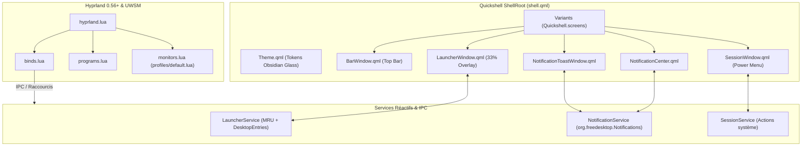

```
██╗  ██╗██████╗  ██████╗       ██╗  ██╗██╗   ██╗██████╗ ██████╗ ██╗      █████╗ ███╗   ██╗██████╗ 
██║  ██║██╔══██╗██╔════╝       ██║  ██║╚██╗ ██╔╝██╔══██╗██╔══██╗██║     ██╔══██╗████╗  ██║██╔══██╗
███████║██║  ██║██║  ███╗█████╗███████║ ╚████╔╝ ██████╔╝██████╔╝██║     ███████║██╔██╗ ██║██║  ██║
██╔══██║██║  ██║██║   ██║╚════╝██╔══██║  ╚██╔╝  ██╔═══╝ ██╔══██╗██║     ██╔══██║██║╚██╗██║██║  ██║
██║  ██║██████╔╝╚██████╔╝      ██║  ██║   ██║   ██║     ██║  ██║███████╗██║  ██║██║ ╚████║██████╔╝
╚═╝  ╚═╝╚═════╝  ╚═════╝       ╚═╝  ╚═╝   ╚═╝   ╚═╝     ╚═╝  ╚═╝╚══════╝╚═╝  ╚═╝╚═╝  ╚═══╝╚═════╝
```

Configuration de bureau Linux moderne, sobre et unifiée sous **Hyprland 0.56+** (Lua) orchestrée par **UWSM** (Universal Wayland Session Manager), avec une suite logicielle native complète développée sous **Quickshell v0.3.1+** (Barre d'état, Centre de Contrôle, Notifications D-Bus, Menu de Session et Lanceur d'applications).

---

## 🎯 1. Vision Globale & Périmètre Métier

Ce dépôt regroupe l'infrastructure complète d'un environnement de travail Wayland moderne, ultra-performant et esthétiquement soigné :
- **Unification logicielle Quickshell :** Environnement réactif monolithique modulaire sous Quickshell v0.3.1+ (Barre d'état, Centre de Contrôle, Notifications D-Bus, Menu de Session et Lanceur d'applications).
- **Design Obsidian Glass & Glacier Blue :** Identité visuelle sombre translucide inspirée du verre fumé, contrastée par des bordures subtiles et des lueurs bleu glacier.
- **Sobriété énergétique & performances :** 0% CPU au repos, zéro polling permanent, exécutions système asynchrones non-bloquantes (`Quickshell.execDetached`) et empreinte RAM inférieure à 35 Mo pour l'ensemble du shell.
- **Dimensionnement 100% relatif :** Aucune dimension en pixels codée en dur ; adaptation instantanée et mathématique à toutes les résolutions et facteurs d'échelle (FHD, 2.8K 90Hz, 4K multi-écrans).

### Matrice Scope & Out-of-Scope

| Domaine | Couvert (In-Scope) | Hors Périmètre (Out-of-Scope) |
|---|---|---|
| **Compositeur** | Hyprland 0.56+ avec machine de configuration Lua typée | Hyprland legacy (syntaxe `.conf` dépréciée) |
| **Gestionnaire de Session** | UWSM (systemd user slice, variables XDG, launch tracking) | Scripts de session X11, Display Managers lourds |
| **Interface & Shell** | Quickshell (Top Bar, Popups, Notifications, Session, Launcher) | Démons tiers hétérogènes (Waybar, SwayNC, Wlogout, etc.) |
| **Audio & Multimédia** | PipeWire / WirePlumber (`pw-dump`, `PwObjectTracker`), MPRIS | PulseAudio legacy / ALSA direct |
| **Affichage & Écrans** | Profils matériels Lua (`profiles/*.lua`), color depth 10-bit | Scripts bash de détection d'écrans non-déterministes |

---

## 🏛️ 2. Analyse Architecturale & Patterns

### Modèle Architectural

L'architecture repose sur une séparation stricte des responsabilités en couches découplées :
1. **Couche Déclarative Système (Hyprland Lua) :** Déclaration centralisée des raccourcis (`binds.lua`), de l'autostart sécurisé (`programs.lua`) et des profils d'affichage (`monitors.lua`).
2. **Couche Services & Singletons QML (Quickshell) :** Gestionnaires d'état réactifs (`Theme.qml`, `LauncherService.qml`, `NotificationService.qml`, `SessionService.qml`) communicant via D-Bus et IPC Quickshell.
3. **Couche UI / Vues Déclaratives (Wayland Layer-Shell Surfaces) :** Fenêtres `PanelWindow` WlrLayershell réparties dynamiquement sur chaque écran connecté (`Variants { model: Quickshell.screens }`).



### 📁 Arborescence Intégrale du Projet

```
.
├── CHANGELOG.md                         # Journal des modifications conforme à Keep a Changelog
├── LICENSE                              # Licence MIT
├── README.md                            # Documentation d'architecture principale
├── docs/                                # Documentations techniques détaillées
│   ├── quickshell-bar.md                # Guide de la barre d'état et popups (LazyPopup)
│   ├── quickshell-launcher.md           # Guide du lanceur d'applications & mode terminal '>'
│   ├── quickshell-notifications.md      # Guide du serveur de notifications & Centre de Contrôle
│   └── quickshell-session.md           # Guide du menu de session plein écran (Power Menu)
└── .config/
    ├── hypr/
    │   ├── hyprland.lua                 # Point d'entrée de configuration Hyprland (Lua)
    │   ├── binds.lua                    # Table typée des raccourcis clavier & souris
    │   ├── monitors.lua                 # Configuration des écrans & profils matériels
    │   ├── programs.lua                 # Déclaration des applications et autostart sécurisé
    │   ├── hypridle.conf                # Démon d'inactivité avec inhibit_sleep
    │   ├── hyprlock.conf                # Écran de verrouillage graphique
    │   ├── hyprpaper.conf               # Gestionnaire de fond d'écran (bloc wallpaper{})
    │   ├── picture/                     # Fonds d'écran officiels
    │   ├── profiles/                    # Profils de configuration matérielle
    │   │   └── default.lua              # Profil écran principal (2.8K 90Hz, scale 1.25, 10-bit)
    │   └── scripts/                     # Scripts utilitaires idempotents
    │       ├── battery-level.sh         # Surveillance batterie avec parsing sécurisé
    │       └── check-dependencies.sh    # Validation automatisée de l'environnement (exit code)
    ├── kitty/
    │   └── kitty.conf                   # Émulateur de terminal GPU Kitty
    ├── quickshell/                      # Écosystème complet Quickshell v0.3.1
    │   ├── shell.qml                    # Point d'entrée ShellRoot (lazy loading des fenêtres)
    │   ├── theme/                       # Design tokens & Thème
    │   │   ├── Theme.qml                # Singleton de couleurs, typographie, espacements et ratios
    │   │   └── qmldir                   # Déclaration de module
    │   ├── components/                  # Composants graphiques réutilisables
    │   │   ├── GlassCard.qml            # Carte en verre translucide avec bordure lumineuse
    │   │   ├── PillButton.qml           # Bouton pilule interactif avec animation
    │   │   ├── IconLabel.qml            # Label réactif icône + texte
    │   │   ├── ModulePopup.qml          # Fenêtre popup flottante avec survol intelligent
    │   │   ├── LazyPopup.qml            # Loader paresseux avec cycle de vie destroy-on-close
    │   │   └── qmldir                   # Déclaration de module
    │   ├── launcher/                    # Lanceur d'applications natif (Obsidian Glass)
    │   │   ├── LauncherService.qml      # Singleton IPC et gestionnaire de visibilité
    │   │   ├── LauncherWindow.qml       # Fenêtre overlay 33%, mode terminal '>', Top 5 MRU
    │   │   └── qmldir                   # Déclaration de module
    │   ├── notifications/               # Serveur D-Bus & Centre de Contrôle
    │   │   ├── NotificationService.qml  # Démon D-Bus, filtrage des alertes vides, état DND
    │   │   ├── NotificationToastWindow.qml # Toasts flottants 380px avec jauge fluide à 60fps
    │   │   ├── NotificationCenter.qml   # Centre de Contrôle haut-centré (480px, 94% opacité)
    │   │   ├── components/              # Sous-composants modulaires du centre
    │   │   │   ├── QuickSettings.qml    # Toggles 64px carrés (Wi-Fi, BT, Micro, Audio) & Actions
    │   │   │   ├── VolumeBrightnessSliders.qml # Curseurs 42px en capsule de verre
    │   │   │   ├── NotificationList.qml # Liste des notifications (360px max) et état vide
    │   │   │   └── Scratchpad.qml       # Mini bloc-notes 150px persistant (scratchpad.txt)
    │   │   └── qmldir                   # Déclaration de module
    │   ├── session/                     # Menu de session plein écran (Power Menu)
    │   │   ├── SessionService.qml       # Singleton d'actions système et IpcHandler
    │   │   ├── SessionWindow.qml        # Fenêtre plein écran Obsidian Glass avec touches directes
    │   │   └── qmldir                   # Déclaration de module
    │   └── bar/                         # Barre d'état supérieure
    │       ├── BarWindow.qml            # Surface Layer-Shell Top avec zone exclusive
    │       ├── BarContent.qml           # Disposition des sections Gauche, Centre, Droite
    │       ├── sections/                # Sous-sections modulaires de la barre
    │       │   ├── LeftSection.qml      # Lanceur, Workspaces, CPU/RAM/Réseau, MPRIS
    │       │   ├── CenterSection.qml    # Titre de la fenêtre active
    │       │   └── RightSection.qml     # Tâches, tray, jauges, notifications, horloge, power
    │       ├── modules/                 # Modules visibles de la barre
    │       │   ├── LauncherButton.qml   # Bouton déclencheur du lanceur Quickshell
    │       │   ├── Workspaces.qml       # Sélecteur réactif de bureaux virtuels
    │       │   ├── CpuModule.qml        # Jauge et charge CPU (3.8% largeur écran)
    │       │   ├── MemoryModule.qml     # Jauge et consommation RAM (3.8% largeur écran)
    │       │   ├── NetworkModule.qml    # Statut réseau et débits temps réel (3.8% écran)
    │       │   ├── MprisModule.qml      # Lecteur multimédia MPRIS compact (12% écran)
    │       │   ├── ActiveWindow.qml     # Titre de l'application active
    │       │   ├── TaskbarModule.qml    # Icônes des fenêtres ouvertes avec IconImage
    │       │   ├── SystemTrayModule.qml # Zone de notification système SNI filtrée
    │       │   ├── BacklightModule.qml  # Jauge de luminosité
    │       │   ├── VolumeModule.qml     # Jauge de volume PipeWire réactive (sans polling)
    │       │   ├── BatteryModule.qml    # Jauge de batterie UPower
    │       │   ├── NotificationButton.qml # Bouton cloche & compteur non lu
    │       │   ├── ClockModule.qml      # Horloge système cadencée à la minute
    │       │   ├── PowerButton.qml      # Bouton d'accès au menu énergie
    │       │   └── qmldir               # Déclaration de module
    │       └── popups/                  # Popups détaillées au survol / clic
    │           ├── AppPopup.qml         # Aperçu de fenêtre, statut et actions Focus/Fermer
    │           ├── BacklightPopup.qml   # Curseur de luminosité et presets rapides
    │           ├── BatteryPopup.qml     # Débit Watts, autonomie estimée et profils UPower
    │           ├── ClockPopup.qml       # Calendrier dynamique du mois, secondes et uptime
    │           ├── CpuPopup.qml         # Charge globale, charge par cœur et température
    │           ├── MemoryPopup.qml      # RAM et Swap détaillés (Go et pourcentages)
    │           ├── MprisPopup.qml       # Pochette HD centrée et contrôles multimédias
    │           ├── NetworkPopup.qml     # IP, passerelle, débits et boutons nmtui/VPN
    │           ├── PowerPopup.qml       # Menu compact d'extinction rapide
    │           ├── VolumePopup.qml      # Curseur 0-150%, muet et raccourci pavucontrol
    │           └── qmldir               # Déclaration de module
    └── starship.toml                    # Configuration du prompt Starship
```

---

## 🗄️ 3. Modélisation des Données & Persistance

- **Tokens & Ratios Globaux (`Theme.qml`) :** Singleton centralisant les palettes de couleurs (`Qt.rgba`), les polices typographiques, les constantes d'animation, les dimensions fixes standardisées (`notificationPanelWidth: 480`, `notificationToastWidth: 380`) et les fonctions de calcul proportionnel d'écran (`relWidth`, `relHeight`, `relFontSize`).
- **Historique de Fréquence des Applications (`launcher_history.json`) :** Suivi persistant du nombre de lancements par application sous `$XDG_STATE_HOME/quickshell/launcher_history.json` pour garantir un tri MRU (Most Recently/Frequently Used) instantané.
- **Historique des Commandes Terminal (`cmd_history.json`) :** Suivi persistant de la fréquence des commandes shell lancées via le préfixe `>` dans `$XDG_STATE_HOME/quickshell/cmd_history.json` pour alimenter le Top 5 interactif.
- **Bloc-Notes Persistant (`scratchpad.txt`) :** Sauvegarde asynchrone débouncée des notes rapides du Centre de Contrôle sous `$XDG_STATE_HOME/quickshell/scratchpad.txt`.
- **Profils Matériels d'Écran (`profiles/*.lua`) :** Modélisation déclarative des écrans (nom, résolution, taux de rafraîchissement, position, échelle, profondeur de couleur 10-bit et variable de secours).

---

## ⚡ 4. Stack Technique Justifiée

| Technologie / Outil | Version | Rôle | Justification du Choix |
|:---|:---|:---|:---|
| **Hyprland** | `>= 0.56.0` | Compositeur Wayland dynamique | Performance GPU, architecture Wayland native et configuration Lua typée. |
| **UWSM** | `>= 0.20` | Gestionnaire de session Wayland | Intégration Systemd native, gestion des tranches cgroups et autostart standardisé. |
| **Quickshell** | `>= 0.3.1` | Shell unifié (Bar, Notifs, Session, Launcher) | Moteur QtQuick/QML C++, réactivité événementielle, bindings Wayland directs et zéro surcoût. |
| **PipeWire / WirePlumber**| `>= 1.0` | Serveur audio & multimédia | Suivi événementiel sans polling via `PwObjectTracker`, latence ultra-faible. |
| **UPower** | Standard | Gestion énergétique & profils de batterie | API D-Bus standard pour suivi en temps réel et sélection de profils d'alimentation. |
| **Kitty** | Standard | Émulateur de terminal GPU | Rendu OpenGL matériel, support étendu des polices Nerd Font et faible latence. |
| **Starship** | Standard | Prompt de shell universel | Vitesse d'exécution en Rust, compatibilité multi-shell. |

---

## 🛡️ 5. Stratégie de Sécurité & Robustesse

1. **Isolation des Processus & Sandboxing UWSM :**
   - Toutes les applications et commandes terminal lancées depuis le lanceur Quickshell, la barre des tâches ou les raccourcis Hyprland sont exécutées dans leur propre unité Systemd via `uwsm app -- <commande>`.
2. **Gestion Sécurisée de la Veille (`hypridle.conf`) :**
   - Directive `inhibit_sleep = true` activée pour empêcher la mise en veille avant que le verrouillage par `hyprlock` ne soit effectif, éliminant tout risque de session visible lors de la reprise.
3. **Idempotence & Sécurité des Scripts Shell :**
   - Tous les scripts utilitaires respectent strictement la directive `set -euo pipefail`.
   - Contrôle systématique via `shellcheck` et absence de toute variable non initialisée.
4. **Zéro Chemin en Dur & Confidentialité :**
   - Utilisation exclusive des variables d'environnement `$HOME`, `$XDG_CONFIG_HOME`, `$XDG_STATE_HOME` et `os.getenv("HOME")`.
   - Exclusion absolue des fichiers secrets (`credentials`, `.env`) dans `.gitignore`.

---

## 🚨 6. Résilience, Gestion des Erreurs & Observabilité

- **Cascade de Résolution d'Icônes Infaillible :**
  - Moteur de recherche d'icônes à 5 niveaux dans `LauncherWindow.qml` (chemin direct, recherche minuscules, suppression du préfixe reverse-DNS `org.gnome.*`, dictionnaire d'alias et icône de secours Nerd Font thématique contextuelle selon la catégorie).
- **Filtrage Anti-Spam des Notifications :**
  - Rejet automatique des notifications fantômes sans titre ni corps générées par les mises à jour DBus de certains démons d'arrière-plan (`StatusNotifierItem:IconName`).
- **Validation Automatisée de l'Environnement :**
  - Le script [`check-dependencies.sh`](file:///Projets/github/hdg-hyprland/.config/hypr/scripts/check-dependencies.sh) vérifie chaque dépendance obligatoire et optionnelle et émet un code de retour strict (`exit 0` / `exit 1`).

---

## 🚀 7. Performance, Scalabilité & Caching

- **Lazy Loading des Fenêtres Secondaires :**
  - Le lanceur, le menu de session, le centre de contrôle et les toasts ne sont pas préchargés en mémoire. Ils sont instanciés via des `Loader` déclaratifs dans `shell.qml` uniquement lors de leur activation et détruits à la fermeture.
- **Cycle de Vie Destroy-on-Close des Popups (`LazyPopup.qml`) :**
  - Les 10 popups de la barre d'état détruisent leur surface Wayland et buffers GPU dès l'animation de fermeture terminée, libérant intégralement la mémoire vive.
- **Élimination Intégrale du Polling :**
  - Volume audio PipeWire suivi réactivement par `PwObjectTracker`.
  - Horloge cadencée à la minute (`SystemClock.Minutes`).
  - Débit réseau et monitoring système désactivés tant que les popups associées ne sont pas ouvertes (`running: root.visible`).
- **Maintien du Thread Graphique Dédié :**
  - Utilisation exclusive du composant natif et thread-safe `IconImage` (`Quickshell.Widgets`) pour éviter tout risque de crash de texture sous Qt 6 / Wayland.
  - Exécutions externes toujours asynchrones via `Quickshell.execDetached`.

---

## 🛠️ 8. Guide de Démarrage & Standard de Qualité

### Prérequis Système
- Distribution Linux avec Wayland (Arch Linux, Fedora, Debian Sid, NixOS).
- Packages obligatoires : `hyprland>=0.56.0`, `quickshell>=0.3.1`, `uwsm`, `kitty`, `hypridle`, `hyprlock`, `hyprpaper`, `brightnessctl`, `playerctl`, `wpctl`, `wl-copy`, `wl-paste`, `cliphist`.

### Procédure d'Installation

```bash
# 1. Cloner le dépôt dans votre répertoire de travail
git clone https://github.com/hdg-zero/hdg-hyprland.git
cd hdg-hyprland

# 2. Valider la conformité des dépendances
.config/hypr/scripts/check-dependencies.sh

# 3. Créer les liens symboliques vers ~/.config/
REPO_PATH="$(pwd)"

for dir in hypr kitty quickshell; do
  if [ -e "$HOME/.config/$dir" ] && [ ! -L "$HOME/.config/$dir" ]; then
    mv "$HOME/.config/$dir" "$HOME/.config/${dir}.bak"
  fi
  ln -sf "$REPO_PATH/.config/$dir" "$HOME/.config/$dir"
done

for file in starship.toml; do
  if [ -f "$HOME/.config/$file" ] && [ ! -L "$HOME/.config/$file" ]; then
    mv "$HOME/.config/$file" "$HOME/.config/${file}.bak"
  fi
  ln -sf "$REPO_PATH/.config/$file" "$HOME/.config/$file"
done
```

### Raccourcis Clavier Principaux

| Raccourci | Action |
|:---|:---|
| <kbd>SUPER</kbd> + <kbd>Espace</kbd> | Lanceur d'applications Quickshell (Obsidian Glass 5 colonnes / Mode `>`) |
| <kbd>SUPER</kbd> + <kbd>Entrée</kbd> | Terminal Kitty |
| <kbd>SUPER</kbd> + <kbd>E</kbd> | Gestionnaire de fichiers Nautilus |
| <kbd>SUPER</kbd> + <kbd>M</kbd> | Menu de session plein écran (Power Menu) |
| <kbd>SUPER</kbd> + <kbd>F</kbd> | Centre de Contrôle & Notifications (Haut-centré) |
| <kbd>SUPER</kbd> + <kbd>Q</kbd> | Fermer la fenêtre active |
| <kbd>SUPER</kbd> + <kbd>V</kbd> | Basculer en mode flottant |
| <kbd>SUPER</kbd> + <kbd>P</kbd> | Capture d'écran zone interactive (`hyprshot`) |
| <kbd>SUPER</kbd> + <kbd>W</kbd> | Historique du presse-papier |

---

## 🔮 9. Dette Technique & Vision Moyen Terme

- [x] Barre d'état Quickshell interactive multi-écrans et popups détaillées avec `LazyPopup.qml`.
- [x] Serveur de notifications D-Bus et Centre de Contrôle haut-centré (480px, 94% opacité, toggles 64px carrés).
- [x] Menu de Session plein écran natif Quickshell sous UWSM.
- [x] Lanceur d'applications natif Quickshell avec mode terminal `>` et Top 5 des commandes shell.
- [x] Lazy loading intégral et cycle de vie destroy-on-close sur toutes les fenêtres secondaires et popups.
- [ ] Support d'un sélecteur graphique de fonds d'écran intégré à Quickshell.
- [ ] Module de gestion de profils d'affichage multi-écrans à la volée depuis le Centre de Contrôle.

---

## 📄 Licence

Ce projet est distribué sous licence MIT. Voir le fichier [LICENSE](LICENSE) pour plus d'informations.
