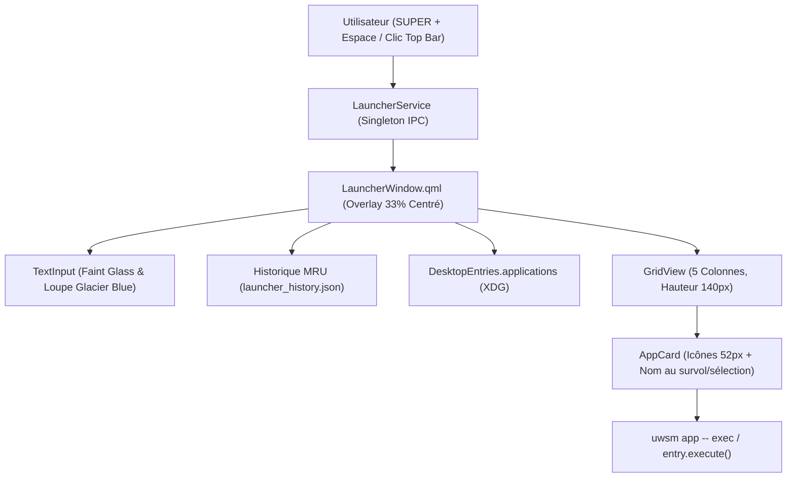

# 💎 Écosystème Quickshell (`hdg-quickshell`)

Documentation technique et guide d'architecture de la suite logicielle native développée sous **[Quickshell](https://quickshell.outfoxxed.me/) v0.3.1+** pour l'environnement **Hyprland 0.56+ / Wayland**.

---

## 🎯 1. Vision & Objectifs

Quickshell unifie et remplace l'intégralité des démons et interfaces graphiques externes (`waybar`, `swaync`, `wlogout`, `rofi`). Ses objectifs fondamentaux sont :
- **Sobriété énergétique & performances maximales :** Empreinte RAM minimale (< 35 Mo pour l'ensemble des modules), zéro réveil processeur inutile au repos (0% CPU idle).
- **Interactivité riche :** Chaque module de la barre dispose d'une fenêtre flottante (**Popup**) détaillée et interactive qui s'ouvre au survol ou au clic.
- **Design Obsidian Glass & Glacier Blue :** Esthétique moderne "Liquid Glass" sombre et translucide avec bordures subtiles et accents bleu glacier.
- **Support Multi-Écrans Natif :** Déploiement automatique et dynamique sur tous les moniteurs connectés via `Quickshell.screens` et des blocs `Variants` dédiés.
- **Dimensionnement Responsive :** Échelle proportionnelle à la résolution d'écran (`relWidth`, `relHeight`) sans décalage ni saut visuel lors des variations de charge ou de format.

---

## 🏛️ 2. Architecture & Arborescence

L'ensemble de la configuration réside dans `.config/quickshell/` :

```
.config/quickshell/
├── shell.qml                    # Point d'entrée principal ShellRoot (Multi-moniteurs)
├── theme/                       # Design tokens & Thème
│   ├── Theme.qml                # Singleton de couleurs, typographie, espacements et animations
│   └── qmldir                   # Déclaration du module Theme
├── components/                  # Composants graphiques réutilisables
│   ├── GlassCard.qml            # Carte de fond translucide avec flou et bordure
│   ├── PillButton.qml           # Bouton pilule responsive (% largeur écran, icône + texte)
│   ├── IconLabel.qml            # Label combiné icône/texte avec animation de couleur
│   ├── ModulePopup.qml          # Fenêtre flottante PopupWindow (survol intelligent, fondu)
│   └── qmldir                   # Déclaration du module Components
├── launcher/                    # Lanceur d'applications natif (remplacement de Rofi)
│   ├── LauncherService.qml      # Singleton IPC (toggle, open, close) et visibilité
│   ├── LauncherWindow.qml       # Fenêtre overlay 33%, grille 5 colonnes, tri MRU, animation Apple
│   └── qmldir                   # Déclaration du module Launcher
├── notifications/               # Serveur de notifications natif & Centre de Contrôle
│   ├── NotificationService.qml  # Singleton D-Bus (NotificationServer), état DND, historique, IPC
│   ├── NotificationToastWindow.qml # Fenêtre de toasts flottants OSD avec compte à rebours fluide 60fps
│   ├── NotificationCenter.qml   # Centre de Contrôle Glassmorphism (conteneur modulaire)
│   ├── components/              # Sous-composants modulaires à responsabilité unique
│   │   ├── QuickSettings.qml    # Toggles Wi-Fi, Bluetooth, Audio, Micro, Verrouiller, Session
│   │   ├── VolumeBrightnessSliders.qml # Curseurs horizontaux en capsule de verre
│   │   ├── NotificationList.qml # Liste des notifications, actions et état vide
│   │   └── Scratchpad.qml       # Mini bloc-notes persistant (scratchpad.txt)
│   └── qmldir                   # Déclaration du module Notifications
├── session/                     # Menu de session plein écran natif (Power Menu)
│   ├── SessionService.qml       # Singleton d'état, helper d'actions et IpcHandler
│   ├── SessionWindow.qml        # Fenêtre plein écran Obsidian Glass avec raccourcis directs
│   └── qmldir                   # Déclaration du module Session
└── bar/                         # Barre d'état
    ├── BarWindow.qml            # Fenêtre PanelWindow WlrLayershell (Top)
    ├── BarContent.qml           # Disposition des 3 sections (Gauche, Centre, Droite)
    ├── qmldir                   # Déclaration du module Bar
    ├── modules/                 # Modules visibles dans la barre
    │   ├── LauncherButton.qml   # Déclencheur du lanceur Quickshell (LauncherService.toggle)
    │   ├── Workspaces.qml       # Sélecteur de workspaces Hyprland
    │   ├── CpuModule.qml        # Jauge et charge CPU (3.8% écran)
    │   ├── MemoryModule.qml     # Jauge et utilisation RAM (3.8% écran)
    │   ├── NetworkModule.qml    # État connexion et débits (3.8% écran)
    │   ├── MprisModule.qml      # Lecteur musical MPRIS (12% écran)
    │   ├── ActiveWindow.qml     # Titre de la fenêtre active
    │   ├── TaskbarModule.qml    # Barre de tâches avec icônes d'applications ouvertes
    │   ├── SystemTrayModule.qml # Zone de notification système (System Tray filtré)
    │   ├── BacklightModule.qml  # Jauge de rétroéclairage
    │   ├── VolumeModule.qml     # Jauge de volume audio PipeWire réactive (PwObjectTracker)
    │   ├── BatteryModule.qml    # Jauge de batterie UPower
    │   ├── NotificationButton.qml # Centre de notifications & badge réactif DND
    │   ├── ClockModule.qml      # Horloge à la minute (SystemClock)
    │   ├── PowerButton.qml      # Menu de session et énergie
    │   └── qmldir               # Déclaration du module Modules
    └── popups/                  # Fenêtres flottantes interactives
        ├── AppPopup.qml         # Aperçu d'application, badges d'état et actions Focus/Fermer
        ├── BacklightPopup.qml   # Curseur de luminosité et presets rapides
        ├── BatteryPopup.qml     # Taux de décharge/charge, temps restant et profils UPower
        ├── ClockPopup.qml       # Horloge précise, calendrier dynamique du mois et uptime
        ├── CpuPopup.qml         # Température, détail par cœur, load average et Top 5 processus
        ├── MemoryPopup.qml      # RAM, Swap détaillé et Top 5 processus RAM
        ├── MprisPopup.qml       # Pochette d'album HD centrée, métadonnées et contrôles complets
        ├── NetworkPopup.qml     # IP locale, passerelle, débits UP/DOWN et boutons nmtui/VPN
        ├── PowerPopup.qml       # Verrouiller, Veille, Redémarrer, Éteindre, Déconnexion
        ├── VolumePopup.qml      # Curseur 0-150%, presets rapides, mute et mixeur Pavucontrol
        └── qmldir               # Déclaration du module Popups
```

---

## 🎨 3. Design System (`Theme.qml`)

Le design system repose sur une palette sombre et épurée inspirée du verre fumé :

| Token | Valeur | Rôle |
| :--- | :--- | :--- |
| `background` | `#e00b0f14` | Fond principal de la barre et fenêtres (Obsidian Glass 88% opacité) |
| `cardBackground` | `#f0121920` | Fond des cartes flottantes et popups (94% opacité) |
| `cardBackgroundHover` | `#fa232f3c` | Fond des éléments au survol (98% opacité) |
| `glassBorder` | `#405dade2` | Bordure subtile façon verre (Glacier Blue 25% opacité) |
| `accent` | `#5dade2` | Couleur d'accent principale (Glacier Blue) |
| `accentSecondary` | `#85c1e9` | Couleur d'accent secondaire (Glacier Light Blue) |
| `success` | `#2ecc71` | Vert pour statut connecté / validation |
| `warning` | `#ffb86c` | Orange ambre pour le mode DND / alertes |
| `destructive` | `#ff6b6b` | Rouge pour mute micro/audio, fermeture, extinction |
| `fontFamily` | `"JetBrainsMono Nerd Font", monospace` | Police principale pour l'interface et les icônes |
| `barHeightRatio` | `0.024` | Hauteur relative fine de la top barre (~25px en 1080p, ~34px en 1440p) |
| `progressBarHeight` | `8px` | Épaisseur des jauges et curseurs de progression |
| `moduleWidthPercentMetrics` | `0.038` | Largeur relative des modules CPU / RAM / Réseau (3.8% de l'écran) |
| `moduleWidthPercentMpris` | `0.12` | Largeur relative du module Musique (12% de l'écran) |
| `popupWidthPercent*` | `0.11 ➔ 0.16` | Largeurs relatives des fenêtres popups (11% à 16% de l'écran) |

---

## 🕹️ 4. Modules et Fenêtres Flottantes (Popups)

### 📌 4.1 Section Gauche (Système & Navigation)
- **󰣇 Lanceur (`LauncherButton`) :** Déclenche `LauncherService.toggle()` (Lanceur Quickshell).
- **Workspaces (`Workspaces`) :** 
  - Affiche les bureaux actifs et occupés.
  - Clic gauche : Bascule sur le bureau sélectionné.
  - Molette souris : Navigation séquentielle `e-1` / `e+1`.
- **󰻠 CPU (`CpuModule` + `CpuPopup`) :**
  - Barre : Largeur fixée à 3.8% de l'écran (`widthPercent: 0.038`).
  - Popup épuré : Jauge fine, pourcentage, température matérielle (``), détail par cœur et load average (``).
- **󰍛 Mémoire (`MemoryModule` + `MemoryPopup`) :**
  - Barre : Largeur fixée à 3.8% de l'écran (`widthPercent: 0.038`).
  - Popup épuré : Jauge fine, pourcentage, RAM utilisée / totale et pourcentage Swap.
- **󰤨 Réseau (`NetworkModule` + `NetworkPopup`) :**
  - Barre : Largeur fixée à 3.8% de l'écran (`widthPercent: 0.038`).
  - Popup épuré : Nom du WiFi / Filaire + signal, adresse IP locale, débits instantanés (↓/↑) et boutons d'action rapide (**Connexions**, **Terminal nmtui**, **VPN**).
- **󰝚 Lecteur Multimédia (`MprisModule` + `MprisPopup`) :**
  - Barre : Largeur fixée à 12% de l'écran (`widthPercent: 0.12`) avec défilement/troncature propre.
  - Clic gauche : Lecture / Pause immédiate (`togglePlaying()`).
  - Clic droit : Ouvre la popup détaillée.
  - Clic milieu & Molette : Piste suivante / précédente.
  - Popup épuré : Pochette d'album HD grand format centrée, titre, artiste, album et contrôles multimédias 100% relatifs.

### 📌 4.2 Section Centre
- **Fenêtre Active (`ActiveWindow`) :** Titre épuré de l'application en cours de focus.

### 📌 4.3 Section Droite (Tâches & Contrôle Matériel)
- **Barre des Tâches (`TaskbarModule` + `AppPopup`) :**
  - Affiche les icônes haute résolution des fenêtres ouvertes sous Hyprland via le composant thread-safe `IconImage`.
  - Clic gauche : Focus et passage au premier plan de l'application.
  - Clic milieu : Fermeture de la fenêtre.
  - **Popup d'Aperçu au survol (`AppPopup`) :**
    - Nom de l'application, badge de workspace assigné, titre de fenêtre sur une ligne et boutons compacts **󰘳 Basculer** (focus) et **󰅖 Fermer**.
- **System Tray (`SystemTrayModule`) :** Zone de notification SNI native Wayland filtrée (élimination des applets réseaux redondantes) avec support clic gauche, clic droit et molette.
- **󰃠 Luminosité (`BacklightModule` + `BacklightPopup`) :**
  - Molette sur la barre : Ajustement par pas de 3%.
  - Popup épuré : Curseur interactif 1-100% et presets rapides (25%, 50%, 75%, 100%).
- **󰕾 Volume Audio (`VolumeModule` + `VolumePopup`) :**
  - Suivi réactif sans polling via `Pipewire.defaultAudioSink.audio`.
  - Molette sur la barre : Ajustement par pas de 5%.
  - Clic droit : Ouvre le mixeur `pavucontrol`.
  - Popup épuré : Curseur interactif 0-150% PipeWire, bouton Muet et raccourci mixeur `󰓃`.
- **󰁹 Batterie (`BatteryModule` + `BatteryPopup`) :**
  - Détection automatique (masqué sur PC fixe).
  - Popup épuré : Jauge fine, pourcentage, temps restant estimé, débit en Watts et sélecteur de profils UPower (**Éco**, **Équilibré**, **Max**).
- **󰂚 Centre de Contrôle & Notifications (`NotificationButton` + `NotificationCenter`) :**
  - Clic gauche : Ouvre/Ferme le Centre de Contrôle natif Quickshell (`NotificationService.togglePanel()`).
  - Clic droit : Bascule le mode Ne Pas Déranger (`NotificationService.toggleDnd()`).
  - Badge dynamique en temps réel sans polling affichant le nombre de notifications non lues.
  - Toasts OSD flottants (`NotificationToastWindow`) avec compte à rebours de fermeture automatique.
- **󰥔 Horloge (`ClockModule` + `ClockPopup`) :**
  - Barre : Heure au format `HH:mm` cadencée à la minute (`SystemClock.Minutes`).
  - Popup épuré : Heure avec secondes, date en français, calendrier compact du mois avec jour courant en surbrillance et Uptime système.
- **⏻ Menu Énergie (`PowerButton` + `PowerPopup`) :**
  - Clic gauche : Menu rapide compact (Verrouiller, Veille, Déconnexion, Redémarrer, Éteindre).
  - Clic droit : Ouvre le Menu de Session plein écran natif (`SessionService.toggleSession()`).

---

## ⚡ 5. Modèle d'Interaction & Confort Visuel

### ⏱️ Survol Intelligent & Anti-Scintillement
Dans [`ModulePopup.qml`](file:///Projets/github/hdg-hyprland/.config/quickshell/components/ModulePopup.qml), la gestion du survol est orchestrée avec précision :
- **Délai d'ouverture (`140 ms`) :** Empêche l'ouverture intempestive lors du simple passage rapide de la souris.
- **Délai de fermeture (`320 ms`) :** Laisse à l'utilisateur le temps de déplacer le curseur de la barre vers la popup sans la fermer.
- **`HoverHandler` non-bloquant :** Maintient la popup ouverte même lors de l'interaction avec des boutons internes, sliders ou listes d'éléments.

### 🎬 Animations Fluides
Toutes les transitions d'ouverture et de fermeture utilisent des courbes cubiques réactives :
- **Fondu d'opacité :** `0.0 ➔ 1.0` en 150 ms (`Easing.OutCubic`).
- **Micro-zoom d'apparition :** `scale: 0.95 ➔ 1.0` ancré sur le haut de la fenêtre.

---

## 🔋 6. Optimisations de Performance & Sobriété Énergétique

1. **Lazy-loading strict des processus système :**
   Les commandes lourdes (`ps -eo ...`, `cat /proc/meminfo`, lectures d'interfaces réseau) sont rattachées à la propriété `running: root.visible`. Elles ne consomment aucun cycle CPU tant que le popup associé n'est pas ouvert par l'utilisateur.
2. **Horloge cadencée à la minute :**
   Utilisation de `SystemClock` avec `precision: SystemClock.Minutes` sur la barre principale pour éliminer les réveils de timers chaque seconde.
3. **Exécution Asynchrone `Quickshell.execDetached` :**
   Toutes les interactions et lancements de commandes externes (`hyprctl`, `wpctl`, `brightnessctl`, `powerprofilesctl`) sont exécutés de façon asynchrone et détachée, prévenant tout blocage du thread graphique de rendu.

---

## 🔔 7. Architecture du Serveur de Notifications & Centre de Contrôle Natif

Le sous-système de notifications réside dans `.config/quickshell/notifications/` et remplace intégralement SwayNC :

### 1. `NotificationService.qml` (Singleton D-Bus)
- **Serveur D-Bus natif :** Instancie `Quickshell.Services.Notifications.NotificationServer` qui revendique le nom de bus standard `org.freedesktop.Notifications`.
- **Filtrage Intelligent :** Rejet immédiat des notifications vides sans titre ni corps.
- **Gestionnaire DND (Ne Pas Déranger) :** Filtre l'affichage des alertes visuelles tout en conservant l'historique complet.
- **Handler IPC & Raccourcis :** Enregistre une cible IPC (`target: "notifications"`) permettant le contrôle par scripts et binds Hyprland :
  ```bash
  quickshell ipc call notifications toggle
  quickshell ipc call notifications toggleDnd
  quickshell ipc call notifications clear
  ```

### 2. `NotificationToastWindow.qml` (Toasts Flottants OSD)
- Fenêtre en calque `Overlay` affichant les notifications entrantes dans le coin supérieur droit.
- Barre de progression d'expiration visuelle animée à 60fps via `NumberAnimation`.
- Mise en pause automatique du compte à rebours au survol de la souris.

### 3. `NotificationCenter.qml` (Centre de Contrôle Glassmorphism Décomposé)
- **Architecture modulaire :** Découpé en 4 sous-composants dédiés sous `.config/quickshell/notifications/components/` :
  - **`QuickSettings.qml` :** Toggles rapides compacts sans texte (Wi-Fi, Bluetooth, Micro, Audio) et raccourcis Verrouiller / Session.
  - **`VolumeBrightnessSliders.qml` :** Curseurs horizontaux en capsule de verre avec icône intégrée et pourcentage réactif.
  - **`NotificationList.qml` :** Historique avec suppression unitaire ou globale (`󰃢`) et support complet des actions.
  - **`Scratchpad.qml` :** Bloc-notes persistant synchronisé avec `scratchpad.txt` et raccourci de copie instantanée (`wl-copy`).

---

## 🚪 8. Architecture du Menu de Session Plein Écran Natif

Le module de session réside dans `.config/quickshell/session/` et remplace intégralement `wlogout` :

### 1. `SessionService.qml` (Singleton d'État & IPC)
- Maintient la visibilité du menu de session (`sessionVisible`).
- Expose l'API de contrôle système (`lock()`, `suspend()`, `logout()`, `hibernate()`, `reboot()`, `shutdown()`).
- Handler IPC (`target: "session"`) pour le contrôle Hyprland (`SUPER + M`) :
  ```bash
  quickshell ipc call session toggle
  quickshell ipc call session open
  quickshell ipc call session close
  ```

### 2. `SessionWindow.qml` (Fenêtre Plein Écran Glassmorphism)
- **Calque Overlay avec Focus Exclusif :** Capture immédiatement toutes les touches dès l'ouverture.
- **Raccourcis Clavier Directs :**
  - <kbd>L</kbd> : Verrouiller (`hyprlock`)
  - <kbd>U</kbd> : Veille (`loginctl lock-session && systemctl suspend`)
  - <kbd>E</kbd> : Déconnexion (`uwsm stop`)
  - <kbd>H</kbd> : Hiberner (`systemctl hibernate`)
  - <kbd>R</kbd> : Redémarrer (`systemctl reboot`)
  - <kbd>S</kbd> : Éteindre (`systemctl poweroff`)
  - <kbd>Échap</kbd> ou **Clic extérieur** : Fermeture instantanée du menu.
- **Cartes Obsidian Glass :** 6 grandes cartes tactiles animées au survol avec halo de couleur et micro-scale responsive.

---

## 🚀 9. Architecture du Lanceur d'Applications Natif (App Launcher)

Le module de lanceur d'applications réside dans `.config/quickshell/launcher/` et remplace intégralement `rofi` :



### 1. `LauncherService.qml` (Singleton d'État & IPC)
- Gère la visibilité réactive du lanceur (`launcherVisible`).
- Enregistre une cible IPC dédiée (`target: "launcher"`) pour le raccourci Hyprland <kbd>SUPER</kbd> + <kbd>Espace</kbd> :
  ```bash
  quickshell ipc call launcher toggle
  quickshell ipc call launcher open
  quickshell ipc call launcher close
  ```

### 2. `LauncherWindow.qml` (Fenêtre de Lanceur Glassmorphic)
- **Dimensions & Format :** Fenêtre centrale occupant exactement **33% de la largeur d'écran** (`Theme.relWidth(0.33, root.screen)`), fond Obsidian Glass (`rgba(11, 15, 20, 0.85)`), fine bordure Glacier Blue (`rgba(93, 173, 226, 0.35)`) et coins arrondis à 20px.
- **Animation Style Apple (Spotlight / Springboard) :** Apparition fluide avec micro-zoom `0.92 ➔ 1.0` et courbe de rebond élastique subtile `Easing.OutBack` (220ms).
- **Grille 5 Colonnes & Centrage Dynamique :** Cellules aérées de **140px de hauteur** avec grandes icônes de **52x52px**. Lorsqu'il reste moins de 5 éléments filtrés, la rangée se recentre automatiquement au milieu de la carte.
- **Révélation Épurée des Noms :** Les noms des applications sont invisibles par défaut pour une grille épurée et apparaissent en fondu uniquement lors de la présélection au clavier ou du survol souris.
- **Tri Intelligent par Fréquence d'Utilisation (MRU) :** Suivi persistant des lancements dans `$XDG_STATE_HOME/quickshell/launcher_history.json`. Les applications les plus fréquemment ouvertes apparaissent en tête de liste sans recherche, et les correspondances exactes sont priorisées lors de la saisie.
- **Cascade de Résolution d'Icônes Infaillible :** Moteur multi-niveaux résolvant les chemins directs, noms minuscules, suppression de reverse-DNS `org.gnome.*`, dictionnaire d'alias et icône Nerd Font contextuelle adaptée selon la catégorie en cas d'absence de fichier image.
